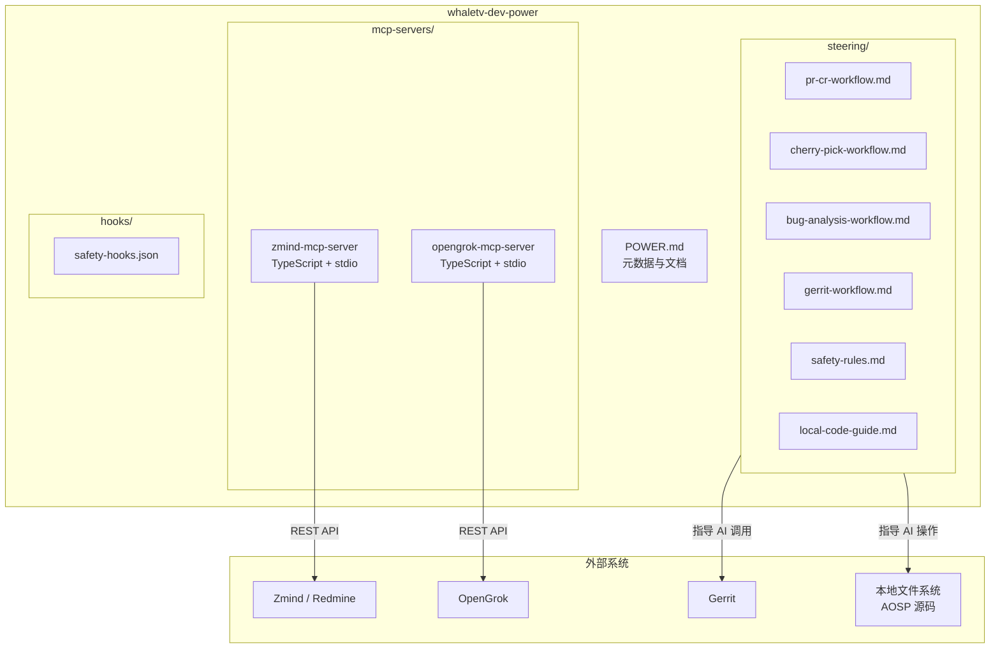
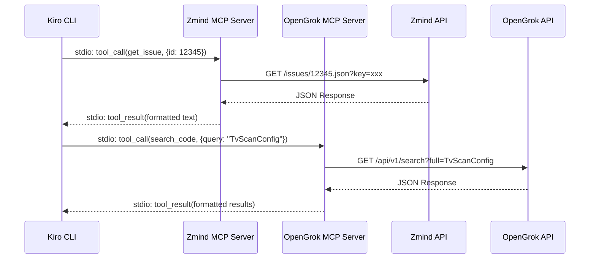
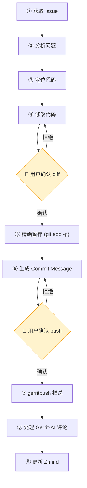
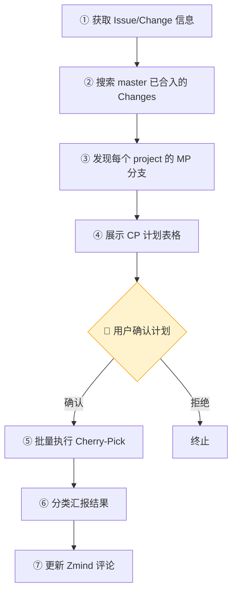
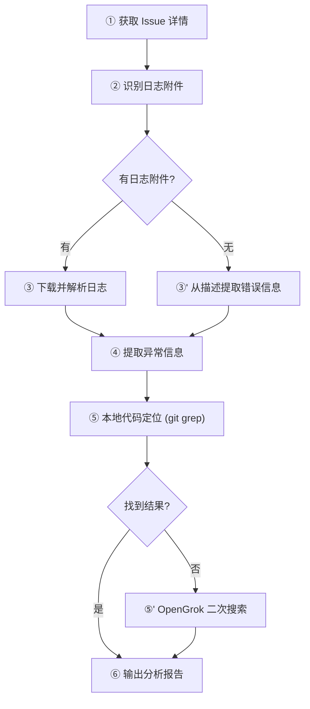
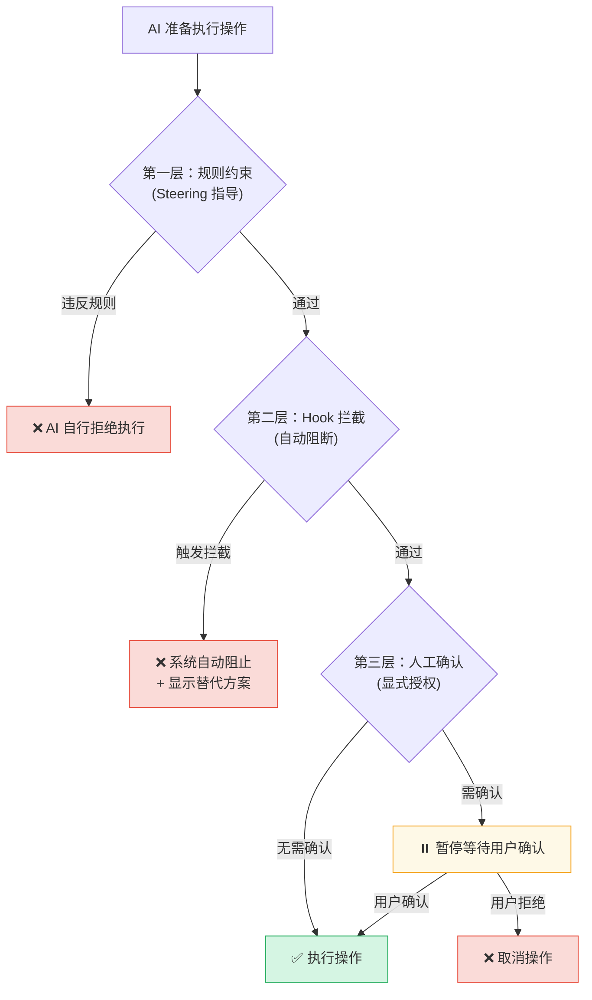
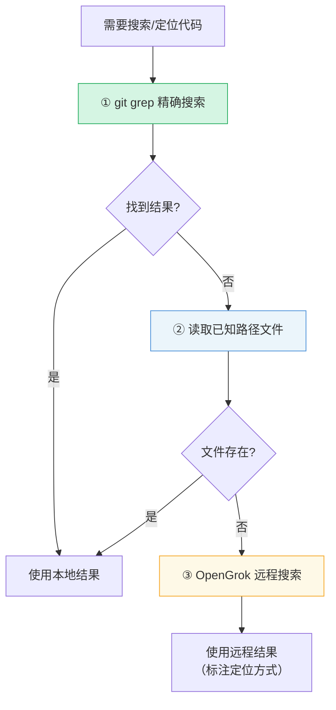

# 设计文档：WhaleTV Developer Power

## 概述

WhaleTV Developer Power（`whaletv-dev-power`）是一个面向 WhaleTV 全体 AOSP 开发者的 Kiro Power 工具包。它将团队已验证的 MCP 服务器（Zmind 项目管理、OpenGrok 代码搜索）、工作流指南（Steering Files）和安全防护机制打包为一个可直接导入使用的 Power，使开发者在远程 Linux 服务器上通过 Kiro CLI 即可获得完整的 AI 辅助开发能力。

本设计文档覆盖项目目录结构、MCP 服务器架构、Steering 文件设计、安全机制、本地源码集成策略及配置发布方案。

## 架构总览



## 项目目录结构

```
whaletv-dev-power/
├── POWER.md                          # Power 元数据、文档、配置说明
├── mcp-servers/
│   ├── zmind-mcp-server/
│   │   ├── package.json              # 依赖声明（固定版本）
│   │   ├── tsconfig.json             # TypeScript 编译配置
│   │   └── src/
│   │       └── index.ts              # Zmind MCP Server 入口
│   └── opengrok-mcp-server/
│       ├── package.json              # 依赖声明（固定版本）
│       ├── tsconfig.json             # TypeScript 编译配置
│       └── src/
│           └── index.ts              # OpenGrok MCP Server 入口
├── steering/
│   ├── pr-cr-workflow.md             # PR/CR 处理工作流
│   ├── cherry-pick-workflow.md       # Cherry-Pick 同步工作流
│   ├── bug-analysis-workflow.md      # Bug 分析工作流
│   ├── gerrit-workflow.md            # Gerrit 操作工作流
│   ├── safety-rules.md              # 安全规则与约束
│   └── local-code-guide.md          # 本地源码操作指南
└── hooks/
    └── safety-hooks.json             # Hook 拦截规则定义
```


## MCP 服务器设计

### 整体架构

两个 MCP 服务器均采用 TypeScript 实现，基于 `@modelcontextprotocol/sdk` 框架，使用 stdio 传输协议与 Kiro CLI 通信。



### 组件 1：Zmind MCP Server

**目的**：为 AI 提供对 Zmind（Redmine）系统的完整读写能力，覆盖 Issue 管理、工时记录、项目查询等操作。

**技术栈**：
- 运行时：Node.js 18+ (ES2022)
- 框架：`@modelcontextprotocol/sdk` (stdio transport)
- 参数校验：`zod`
- HTTP 客户端：Node.js 内置 `fetch`

**接口定义**：

```typescript
// 环境变量
interface ZmindConfig {
  ZMIND_URL: string;      // 默认 "https://zmind.whaletv.com"
  ZMIND_API_KEY: string;  // 必需，用户 API 密钥
}

// 核心 HTTP 辅助函数
async function redmineGet(path: string, params?: Record<string, string>): Promise<any>;
async function redminePut(path: string, body: any): Promise<number>;
async function redminePost(path: string, body: any): Promise<any>;
```

**工具清单**：

| 工具名 | 类型 | 参数 | 返回 |
|--------|------|------|------|
| `get_issue` | 查询 | issue_id: number | Issue 完整详情（含评论、附件、关联、子任务、可流转状态） |
| `my_issues` | 查询 | status?: "open"\|"closed"\|"*", limit?: number | 当前用户被指派的 Issue 列表 |
| `search_issues` | 查询 | query: string, project?: string, status?, tracker_id?, assigned_to_id?, limit? | 匹配的 Issue 列表 |
| `update_issue` | 写入 | issue_id: number, status_id?, assigned_to_id?, priority_id?, done_ratio?, notes? | 更新确认 + 更新后详情 |
| `create_issue` | 写入 | project_id: string\|number, subject: string, description?, tracker_id?, ... | 新 Issue ID 及详情 |
| `add_comment` | 写入 | issue_id: number, comment: string, private?: boolean | 添加确认 |
| `create_time_entry` | 写入 | issue_id: number, hours: number, activity_id?, spent_on?, comments? | 工时记录确认 |
| `list_projects` | 查询 | limit?: number | 项目列表 |
| `get_versions` | 查询 | project_id: string | 版本列表 |
| `get_project_members` | 查询 | project_id: string | 成员及角色列表 |
| `get_issue_statuses` | 查询 | 无 | 所有状态及 ID |
| `get_trackers` | 查询 | 无 | 所有 Tracker 类型及 ID |
| `get_priorities` | 查询 | 无 | 所有优先级及 ID |
| `get_time_activities` | 查询 | 无 | 工时活动类型列表 |

**错误处理策略**：

```typescript
// 环境变量校验 - 在每次工具调用前检查
function validateConfig(): void {
  if (!process.env.ZMIND_API_KEY) {
    throw new Error("环境变量 ZMIND_API_KEY 未配置，请设置后重试");
  }
}

// API 错误处理 - 捕获并格式化返回
async function redmineGet(path: string, params?: Record<string, string>): Promise<any> {
  validateConfig();
  const url = new URL(path, BASE_URL);
  url.searchParams.set("key", API_KEY);
  if (params) {
    for (const [k, v] of Object.entries(params)) url.searchParams.set(k, v);
  }
  const res = await fetch(url.toString(), {
    headers: { "Content-Type": "application/json" },
  });
  if (!res.ok) {
    const errorText = await res.text();
    throw new Error(`Zmind API 错误 (HTTP ${res.status}): ${errorText}`);
  }
  return res.json();
}
```

**前置条件**：
- `ZMIND_API_KEY` 环境变量已设置且非空
- `ZMIND_URL` 可选，默认 `https://zmind.whaletv.com`
- 网络可达 Zmind 服务

**后置条件**：
- 查询工具返回格式化的中文文本
- 写入工具返回操作确认及更新后的状态
- 所有 API 错误被捕获并以友好信息返回，不抛出未捕获异常

### 组件 2：OpenGrok MCP Server

**目的**：为 AI 提供 AOSP 源码的远程全文搜索和符号定义查找能力，作为本地 `git grep` 的补充手段。

**技术栈**：与 Zmind MCP Server 相同（TypeScript + @modelcontextprotocol/sdk + stdio）

**接口定义**：

```typescript
// 环境变量
interface OpenGrokConfig {
  OPENGROK_URL: string;      // 必需，OpenGrok 服务地址
  OPENGROK_PROJECT: string;  // 可选，默认搜索项目名
}

// 搜索结果类型
interface SearchResult {
  filePath: string;    // 文件路径
  lineNumber: number;  // 行号
  context: string;     // 匹配行前后各 3 行的代码片段
}
```

**工具清单**：

| 工具名 | 参数 | 返回 |
|--------|------|------|
| `search_code` | query: string (1-200字符), max_results?: number (默认20, 上限100) | 匹配的文件路径、行号、代码上下文 |
| `search_symbol` | symbol: string (1-200字符), max_results?: number (默认20, 上限100) | 符号定义位置（文件路径、行号、上下文） |

**核心实现**：

```typescript
import { McpServer } from "@modelcontextprotocol/sdk/server/mcp.js";
import { StdioServerTransport } from "@modelcontextprotocol/sdk/server/stdio.js";
import { z } from "zod";

const OPENGROK_URL = process.env.OPENGROK_URL || "";
const OPENGROK_PROJECT = process.env.OPENGROK_PROJECT || "";
const REQUEST_TIMEOUT = 15000; // 15 秒超时

function validateConfig(): void {
  if (!OPENGROK_URL) {
    throw new Error("环境变量 OPENGROK_URL 未配置，请设置 OpenGrok 服务地址");
  }
}

async function opengrokSearch(
  type: "full" | "def",
  query: string,
  maxResults: number
): Promise<string> {
  validateConfig();

  const url = new URL("/api/v1/search", OPENGROK_URL);
  url.searchParams.set(type, query);
  if (OPENGROK_PROJECT) {
    url.searchParams.set("projects", OPENGROK_PROJECT);
  }
  url.searchParams.set("maxresults", String(maxResults));

  const controller = new AbortController();
  const timeout = setTimeout(() => controller.abort(), REQUEST_TIMEOUT);

  try {
    const res = await fetch(url.toString(), {
      headers: { "Accept": "application/json" },
      signal: controller.signal,
    });

    if (!res.ok) {
      throw new Error(`OpenGrok API 错误 (HTTP ${res.status}): ${await res.text()}`);
    }

    const data = await res.json();
    return formatResults(data, type);
  } catch (err: any) {
    if (err.name === "AbortError") {
      throw new Error(`OpenGrok 请求超时（超过 15 秒），服务地址: ${OPENGROK_URL}`);
    }
    if (err.cause?.code === "ECONNREFUSED" || err.cause?.code === "ENOTFOUND") {
      throw new Error(`无法连接 OpenGrok 服务: ${OPENGROK_URL}，请检查服务是否可达`);
    }
    throw err;
  } finally {
    clearTimeout(timeout);
  }
}

function formatResults(data: any, type: string): string {
  const results = data.results || [];
  if (results.length === 0) {
    return type === "full"
      ? "全文搜索未匹配到任何结果"
      : "符号定义搜索未匹配到任何结果";
  }

  return results
    .map((r: any) => {
      const lines = [
        `文件: ${r.path}:${r.lineNumber}`,
        `上下文:`,
        r.context || r.line,
      ];
      return lines.join("\n");
    })
    .join("\n\n---\n\n");
}

const server = new McpServer({ name: "opengrok", version: "1.0.0" });

server.tool(
  "search_code",
  "在 AOSP 源码中进行全文关键词搜索",
  {
    query: z.string().min(1).max(200).describe("搜索关键词（1-200 字符）"),
    max_results: z.number().min(1).max(100).default(20).describe("最大返回条数"),
  },
  async ({ query, max_results }) => {
    const text = await opengrokSearch("full", query, max_results);
    return { content: [{ type: "text", text }] };
  }
);

server.tool(
  "search_symbol",
  "搜索类、方法、变量的定义位置",
  {
    symbol: z.string().min(1).max(200).describe("符号名称（1-200 字符）"),
    max_results: z.number().min(1).max(100).default(20).describe("最大返回条数"),
  },
  async ({ symbol, max_results }) => {
    const text = await opengrokSearch("def", symbol, max_results);
    return { content: [{ type: "text", text }] };
  }
);

async function main() {
  const transport = new StdioServerTransport();
  await server.connect(transport);
}

main().catch(console.error);
```

**错误处理**：

| 场景 | 处理方式 |
|------|---------|
| `OPENGROK_URL` 未配置 | 返回错误信息指明缺失变量 |
| 服务不可达 (ECONNREFUSED) | 返回连接失败信息含服务地址 |
| 请求超时 (>15s) | 终止请求，返回超时错误 |
| 搜索无结果 | 返回明确提示"未匹配到任何结果" |
| 关键词为空 | zod 校验拦截，返回参数错误 |


## Steering 文件设计

### 设计原则

Steering 文件是 Power 的核心工作流指南，指导 AI 按照团队规范执行多步骤任务。每个 Steering 文件遵循以下结构：

1. **文件头**：工作流名称、触发场景、前置条件
2. **步骤定义**：有序的执行步骤，每步包含 AI 动作和预期输出
3. **人工确认点**：明确标注需要用户确认的节点
4. **错误处理**：每步的失败场景和恢复策略
5. **输出格式**：最终产出物的结构化格式定义

### Steering 1：PR/CR 处理工作流 (`pr-cr-workflow.md`)

**触发场景**：用户请求处理 PR/CR Issue（如"帮我处理 PR #XXXXX"）

**工作流步骤**：



**Commit Message 格式规范**：

```
[版本号][类型][whaletv][Zmind#ID]简述

[what]具体做了什么修改
[why]为什么需要这个修改
[how]如何实现的（技术方案简述）
[test]如何验证（测试方法）
[impact]影响范围
```

- 类型取值：`bugfix` | `feature` | `refactor` | `hotfix`
- 版本号从 Issue 的 target_version 字段获取
- Issue ID 从当前处理的 Issue 获取

**关键约束**：
- 步骤 ④ 完成后必须执行 `git diff` 展示变更，等待用户确认
- 步骤 ⑤ 必须使用 `git add -p` 进行 hunk 级别暂存
- 步骤 ⑦ 执行前必须展示 commit 信息和目标分支，等待确认
- 任一步骤失败时报告错误并等待用户指示

### Steering 2：Cherry-Pick 工作流 (`cherry-pick-workflow.md`)

**触发场景**：用户请求将修复同步到 MP 分支（如"把 #332669 cp 到 mp"）

**工作流步骤**：



**CP 计划表格格式**：

| 源 Change | 源 Project | 目标分支 |
|-----------|-----------|---------|
| I1234567 | frameworks/base | os10_mp, os10_3_mp |
| I2345678 | packages/apps/TvSettings | os10_mp |

**结果汇报分类**：
- ✅ 成功：含新 Change 链接
- ⏭️ 跳过：目标分支已包含等效提交
- ❌ 冲突：列出冲突文件，说明需人工处理

**MP 分支发现逻辑**：通过 Gerrit API 查询 project 中名称包含 `_mp` 后缀的活跃分支。

### Steering 3：Bug 分析工作流 (`bug-analysis-workflow.md`)

**触发场景**：用户请求分析 Bug Issue（如"分析下 #334001"）

**工作流步骤**：



**日志文件识别规则**：
- 文件名包含：`log`、`logcat`、`trace`、`tombstone`
- 扩展名为：`.log`、`.txt`、`.gz`、`.zip`

**日志解析提取内容**：
- 异常堆栈（Exception/Error 及调用链）
- 异常前后 5 秒内的时间点事件
- 重复出现 2 次以上的错误关键字

**分析报告输出格式**：

```markdown
## Bug 分析报告

### 现象
- Issue 标题及复现条件

### 关键 Log
（不超过 30 行的核心异常日志片段）

### 根因定位
- 文件:行号
- 定位方式：git grep / OpenGrok

### 修复建议
1. [可操作的修改方向 1]
2. [可操作的修改方向 2]
3. [可操作的修改方向 3]
```

### Steering 4：Gerrit 操作工作流 (`gerrit-workflow.md`)

**触发场景**：代码推送和 Gerrit-AI 评论处理

**工作流步骤**：

1. 使用 `gerritpush` 命令推送代码，自动添加 Reviewer
2. 轮询等待 Gerrit-AI 评论（最多 3 次，间隔 15 秒）
3. 若 3 次轮询后无评论，通知用户并结束
4. 逐条分析评论：
   - 采纳：修复代码 + 回复修复说明 + 标记 resolved
   - 不采纳：回复不采纳理由 + 标记 resolved

### Steering 5：安全规则 (`safety-rules.md`)

详见下方"安全机制设计"章节。

### Steering 6：本地源码操作指南 (`local-code-guide.md`)

详见下方"Kiro CLI 本地源码集成"章节。


## 安全机制设计

### 三层防护体系架构



### 第一层：规则约束（Steering 中定义）

在 `safety-rules.md` Steering 文件中定义 AI 行为边界：

| 规则 | 说明 |
|------|------|
| MP 分支禁止自动推送 | AI 不得在未经用户确认的情况下向任何 `*_mp` 分支推送代码 |
| git add 必须精确到 hunk | 必须使用 `git add -p` 逐 hunk 暂存，禁止 `git add .` 或 `git add -A` |
| Target version 必须用户指定 | AI 不得根据分支名或上下文自行推断 target version |

### 第二层：Hook 拦截（自动阻断）

Hook 配置文件 `hooks/safety-hooks.json` 定义命令匹配模式和拦截动作：

```typescript
// Hook 拦截规则定义
interface HookRule {
  id: string;
  name: string;
  pattern: string;        // 命令匹配正则
  action: "block";        // 拦截动作
  reason: string;         // 拦截原因
  alternative: string;    // 推荐替代操作
}
```

**拦截规则清单**：

| ID | 匹配模式 | 拦截原因 | 推荐替代 |
|----|---------|---------|---------|
| `block-sudo` | `^sudo\s` | 禁止 sudo 命令，避免权限提升风险 | 使用当前用户权限操作 |
| `block-root-search` | `(find\|grep)\s+(/\|~/)` | 禁止在根目录或家目录执行搜索 | 指定具体子目录搜索 |
| `block-tmp-write` | `>\s*/tmp/\|>>/tmp/` | 禁止写入 /tmp 路径 | 使用 ~/tmp 替代 |
| `block-out-search` | `(find\|grep\|ls\s+-R)\s+.*(out/\|prebuilts/)` | 禁止搜索 out/ 或 prebuilts/ 目录 | 搜索 src 目录或使用 git grep |

**Hook 配置文件格式**：

```json
{
  "hooks": [
    {
      "id": "block-sudo",
      "name": "禁止 sudo 命令",
      "eventType": "preToolUse",
      "toolTypes": "shell",
      "pattern": "^sudo\\s",
      "action": "block",
      "reason": "安全策略禁止执行 sudo 命令",
      "alternative": "请使用当前用户权限执行操作"
    },
    {
      "id": "block-root-search",
      "name": "禁止根目录/家目录搜索",
      "eventType": "preToolUse",
      "toolTypes": "shell",
      "pattern": "(find|grep)\\s+(/|~/)",
      "action": "block",
      "reason": "禁止在根目录或家目录执行大范围搜索",
      "alternative": "请指定具体的源码子目录进行搜索"
    },
    {
      "id": "block-tmp-write",
      "name": "禁止写入 /tmp",
      "eventType": "preToolUse",
      "toolTypes": "shell",
      "pattern": ">\\s*/tmp/|>>/tmp/",
      "action": "block",
      "reason": "禁止写入 /tmp 路径，避免临时文件丢失",
      "alternative": "请使用 ~/tmp 目录替代 /tmp"
    },
    {
      "id": "block-out-search",
      "name": "禁止搜索编译输出目录",
      "eventType": "preToolUse",
      "toolTypes": "shell",
      "pattern": "(find|grep|ls\\s+-R)\\s+.*(out/|prebuilts/)",
      "action": "block",
      "reason": "out/ 和 prebuilts/ 目录体积巨大，搜索会导致性能问题",
      "alternative": "请使用 git grep 搜索源码，或指定具体的 src 子目录"
    }
  ]
}
```

### 第三层：人工确认（显式授权）

在 Steering 文件中定义必须等待用户确认的场景：

| 场景 | 确认内容 | 触发条件 |
|------|---------|---------|
| 方案选择 | 展示多个可行方案，等待用户选择 | 存在多个可行方案时 |
| git push | 展示 commit 信息和目标分支 | 任何 push 操作前 |
| 跨代码库操作 | 展示目标仓库范围 | 操作涉及多个代码库时 |
| 代码修改确认 | 展示 `git diff` 完整变更 | 代码修改完成后 |

**拦截信息格式**：

当 Hook 拦截触发时，向用户显示：
```
⚠️ 操作被拦截

被拦截的命令: [具体命令]
拦截原因: [原因说明]
推荐替代: [安全的替代操作]
```


## Kiro CLI 本地源码集成

### 设计目标

在远程 Linux 服务器上，AI 应优先使用本地文件系统直接操作 AOSP 源码，而非仅依赖 OpenGrok 远程搜索。本地操作速度更快、上下文更完整。

### 搜索策略优先级



**优先级说明**：

| 优先级 | 方式 | 适用场景 | 性能 |
|--------|------|---------|------|
| ① 最高 | `git grep` | 当前代码库内精确搜索 | ~0.4s（100GB+ 代码库） |
| ② 中等 | 直接读取文件 | 已知文件路径时 | 即时 |
| ③ 最低 | OpenGrok 远程搜索 | 本地无结果或需跨代码库搜索 | 网络延迟 |

**为什么 git grep 优于 ripgrep**：
- AOSP 代码库 100GB+，ripgrep 全量扫描需 ~40s
- git grep 仅搜索 git 跟踪的文件，自动排除 out/、prebuilts/ 等目录，~0.4s 完成
- git grep 天然排除未跟踪文件，结果更精确

### 典型工作目录结构

Steering 文件中说明的目录结构，帮助 AI 快速定位模块：

```
~/cvte_code/amlogic/          # AOSP 源码根目录
├── frameworks/
│   ├── base/                 # Android Framework 核心
│   │   ├── core/java/        # 核心 Java API
│   │   ├── services/         # System Services
│   │   └── packages/         # Framework 内置包
│   └── av/                   # 多媒体框架
├── packages/
│   ├── apps/                 # 系统应用
│   │   ├── TvSettings/       # TV 设置
│   │   ├── LiveTv/           # 直播电视
│   │   └── ...
│   └── services/             # 系统服务包
├── vendor/
│   └── amlogic/              # Amlogic 厂商定制
│       ├── common/
│       └── ...
├── hardware/
│   └── amlogic/              # HAL 层
├── kernel/                   # 内核源码
└── device/
    └── amlogic/              # 设备配置
```

### Steering 指导内容 (`local-code-guide.md`)

**核心指导规则**：

1. **优先本地操作**：分析 Bug 或处理 PR 时，直接读取本地源码文件获取完整上下文（类的完整实现、调用链上下游），而非仅依赖搜索结果片段

2. **git grep 用法示例**：
   ```bash
   # 搜索类名定义
   git grep -n "class TvScanConfig" -- "*.java"
   
   # 搜索方法调用
   git grep -n "updateIssueStatus" -- "*.java" "*.kt"
   
   # 搜索字符串常量
   git grep -rn "TV_COUNTRY" -- "*.java" "*.xml"
   ```

3. **操作前状态确认**：
   ```bash
   git status          # 确认工作区状态
   git branch          # 确认当前分支
   ```

4. **跨代码库提示**：当需要操作非当前工作目录的代码库时，提示用户切换目录或指定路径，不假设所有 11 套代码库都在当前目录下

5. **非源码目录检测**：如果当前目录不包含 `.repo` 或典型 AOSP 子目录（如 `frameworks/`、`packages/`），提示用户可能不在源码目录，建议切换到正确路径

### 推荐使用方式

在 POWER.md 中说明：

> **推荐使用方式**：在 AOSP 源码根目录或子模块目录下启动 Kiro CLI，使 AI 能直接访问项目文件。
> 
> ```bash
> # 推荐：在源码根目录启动
> cd ~/cvte_code/amlogic && kiro
> 
> # 或在特定模块目录启动
> cd ~/cvte_code/amlogic/frameworks/base && kiro
> ```


## 配置与发布

### POWER.md 元数据结构

```markdown
---
name: whaletv-dev-power
displayName: WhaleTV Developer Power
version: 1.0.0
description: 面向 WhaleTV 开发者的 AOSP 开发辅助工具包，集成 Zmind 项目管理、OpenGrok 代码搜索和团队标准工作流
keywords:
  - whaletv
  - aosp
  - zmind
  - gerrit
  - opengrok
  - cherry-pick
  - pr
  - cr
  - android
  - 项目管理
  - 代码搜索
mcpServers:
  - name: zmind-mcp-server
    path: ./mcp-servers/zmind-mcp-server
    command: npx tsx src/index.ts
    env:
      - ZMIND_API_KEY
      - ZMIND_URL
  - name: opengrok-mcp-server
    path: ./mcp-servers/opengrok-mcp-server
    command: npx tsx src/index.ts
    env:
      - OPENGROK_URL
      - OPENGROK_PROJECT
---
```

### 环境变量配置

| 变量名 | 用途 | 必需 | 默认值 | 格式示例 |
|--------|------|------|--------|---------|
| `ZMIND_API_KEY` | Zmind 用户 API 密钥 | ✅ 是 | 无 | `a1b2c3d4e5f6...`（40 位十六进制） |
| `ZMIND_URL` | Zmind 服务地址 | ❌ 否 | `https://zmind.whaletv.com` | `https://zmind.whaletv.com` |
| `OPENGROK_URL` | OpenGrok 服务地址 | ✅ 是 | 无 | `http://opengrok.zeasn.com:8080` |
| `OPENGROK_PROJECT` | 默认搜索项目名 | ❌ 否 | 无 | `d4_code` |

### 系统要求

| 要求 | 最低版本 | 推荐版本 |
|------|---------|---------|
| 操作系统 | Ubuntu 20.04 LTS | Ubuntu 22.04 LTS |
| Node.js | 18.x | 20.x LTS |
| 运行环境 | 远程 Linux 服务器（CLI） | 无需 GUI |

### 依赖管理

每个 MCP 服务器的 `package.json` 使用固定版本号：

**zmind-mcp-server/package.json**：

```json
{
  "name": "zmind-mcp-server",
  "version": "1.0.0",
  "description": "Zmind (Redmine) MCP Server for WhaleTV Developer Power",
  "type": "module",
  "scripts": {
    "start": "tsx src/index.ts",
    "build": "tsc"
  },
  "dependencies": {
    "@modelcontextprotocol/sdk": "1.12.1",
    "zod": "3.24.4"
  },
  "devDependencies": {
    "@types/node": "24.0.3",
    "tsx": "4.19.4",
    "typescript": "5.8.3"
  }
}
```

**opengrok-mcp-server/package.json**：

```json
{
  "name": "opengrok-mcp-server",
  "version": "1.0.0",
  "description": "OpenGrok AOSP Code Search MCP Server for WhaleTV Developer Power",
  "type": "module",
  "scripts": {
    "start": "tsx src/index.ts",
    "build": "tsc"
  },
  "dependencies": {
    "@modelcontextprotocol/sdk": "1.12.1",
    "zod": "3.24.4"
  },
  "devDependencies": {
    "@types/node": "24.0.3",
    "tsx": "4.19.4",
    "typescript": "5.8.3"
  }
}
```

### 配置验证方法

在 POWER.md 中提供的验证步骤：

```bash
# 1. 检查环境变量是否已设置
echo "ZMIND_API_KEY: ${ZMIND_API_KEY:+已设置}"
echo "OPENGROK_URL: ${OPENGROK_URL:+已设置}"

# 2. 验证 Zmind 连接
curl -s -o /dev/null -w "%{http_code}" \
  "${ZMIND_URL:-https://zmind.whaletv.com}/users/current.json?key=$ZMIND_API_KEY"
# 预期输出: 200

# 3. 验证 OpenGrok 连接
curl -s -o /dev/null -w "%{http_code}" \
  "$OPENGROK_URL/api/v1/configuration"
# 预期输出: 200

# 4. 验证 Node.js 版本
node --version
# 预期输出: v18.x.x 或更高
```

### 排查步骤

**ZMIND_API_KEY 未设置**：
```bash
# 检查
echo $ZMIND_API_KEY

# 设置（添加到 ~/.bashrc 或 ~/.zshrc）
export ZMIND_API_KEY="your-api-key-here"
source ~/.bashrc
```

**OPENGROK_URL 未设置**：
```bash
# 检查
echo $OPENGROK_URL

# 设置
export OPENGROK_URL="http://opengrok.zeasn.com:8080"
source ~/.bashrc
```

**常见错误**：
- API Key 包含多余空格或换行符 → 使用 `echo -n` 验证
- URL 末尾多余斜杠 → 确保不以 `/` 结尾
- 网络不可达 → 检查代理配置或 SSH 隧道状态

## 数据模型

### Issue 格式化输出模型

```typescript
interface FormattedIssue {
  id: number;
  subject: string;
  status: string;
  priority: string;
  assignedTo: string | "未指派";
  project: string;
  tracker: string;
  createdOn: string;
  updatedOn: string;
  doneRatio?: number;
  estimatedHours?: number;
  fixedVersion?: string;
  parent?: number;
  description?: string;
  allowedStatuses?: Array<{ id: number; name: string }>;
  children?: Array<{ id: number; subject: string }>;
  relations?: Array<{ type: string; issueId: number }>;
  attachments?: Array<{ filename: string; url: string }>;
  journals?: Array<{ date: string; user: string; notes: string }>;
}
```

### OpenGrok 搜索结果模型

```typescript
interface OpenGrokSearchResult {
  results: Array<{
    path: string;        // 文件相对路径
    lineNumber: number;  // 匹配行号
    line: string;        // 匹配行内容
    context: string;     // 前后各 3 行上下文
  }>;
  totalHits: number;     // 总匹配数
  duration: number;      // 搜索耗时(ms)
}
```

## 测试策略

### 单元测试

- Zmind MCP Server：Mock HTTP 响应，验证工具参数校验、格式化输出、错误处理
- OpenGrok MCP Server：Mock HTTP 响应，验证超时处理、结果格式化、空结果处理

### 集成测试

- 使用真实 Zmind/OpenGrok 测试环境验证端到端连通性
- 验证环境变量缺失时的错误提示

### Steering 文件验证

- 人工 Review 确保步骤完整性和顺序正确性
- 实际场景演练验证工作流可执行性

## 性能考虑

| 场景 | 策略 |
|------|------|
| AOSP 代码搜索 | 优先 git grep（0.4s）而非 ripgrep（40s） |
| OpenGrok 请求 | 15 秒超时，避免阻塞 |
| Zmind API 调用 | 单次请求，无批量接口时逐条调用 |
| 大日志文件 | 流式读取，提取关键片段而非全量加载 |

## 安全考虑

| 风险 | 缓解措施 |
|------|---------|
| API Key 泄露 | 环境变量存储，不硬编码；Steering 指导不在输出中暴露 Key |
| 误操作 release 分支 | 三层防护：规则约束 + Hook 拦截 + 人工确认 |
| 大范围文件操作 | Hook 拦截根目录/家目录搜索；禁止 sudo |
| 网络安全 | HTTPS 通信；API Key 通过 URL 参数传递（Redmine 标准方式） |

## 依赖清单

| 依赖 | 版本 | 用途 |
|------|------|------|
| `@modelcontextprotocol/sdk` | 1.12.1 | MCP 协议框架 |
| `zod` | 3.24.4 | 运行时参数校验 |
| `typescript` | 5.8.3 | 类型系统（开发时） |
| `tsx` | 4.19.4 | TypeScript 直接执行 |
| `@types/node` | 24.0.3 | Node.js 类型定义 |

## 正确性属性

1. **环境变量校验**：∀ tool_call, 若必需环境变量未设置 → 返回明确错误信息，不执行 API 调用
2. **API 错误传播**：∀ API response with status >= 400, 返回包含 HTTP 状态码的错误信息，不抛出未捕获异常
3. **超时保证**：∀ OpenGrok request, 若响应时间 > 15s → 终止请求并返回超时错误
4. **搜索结果格式**：∀ search result, 包含 filePath + lineNumber + context 三要素
5. **工作流顺序**：∀ PR/CR workflow, 步骤严格按定义顺序执行，人工确认点不可跳过
6. **Hook 拦截完整性**：∀ 匹配拦截模式的命令, 被阻止执行且显示替代方案
7. **暂存精确性**：∀ git add 操作, 必须使用 `-p` 参数进行 hunk 级别暂存
