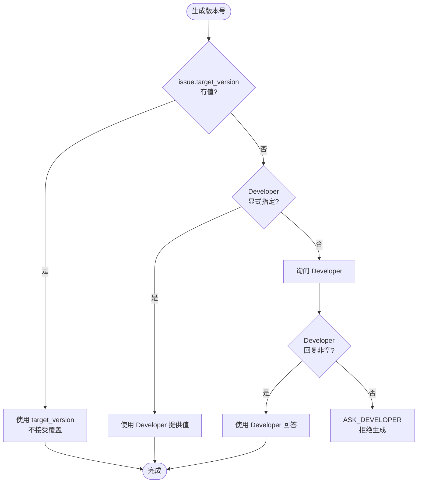

# 智能 Commit Message 工作流

## 触发场景

- 用户在 PR/CR 工作流中执行到 commit message 步骤（pr-cr-workflow.md 步骤 ⑥）
- 用户显式请求"生成 commit message"、"帮我写 commit message"
- 用户在端到端 10 步工作流（章节 ⑧）中走到第 ⑦ 步

## 前置条件

| 条件 | 说明 | 不满足时的行为 |
|------|------|----------------|
| 已 `git add -p` 完成 | 暂存区有变更（`git diff --staged` 非空） | 报错"暂存区为空，请先 git add -p"，终止 |
| 当前会话已关联 Zmind Issue | Developer 提供了 Issue ID 或处于 PR/CR 工作流中 | 拒绝生成，提示 Developer 关联 Issue |
| 远程目标分支已识别 | 已经过 Branch_Detector 五级降级流程产出 `BranchDetectionResult` | 调用 Branch_Detector 同步识别 |
| Zmind MCP Server 可用 | `ZMIND_API_KEY` 已配置 | 报告并终止 |

## 章节索引

- ① 触发场景与前置条件（已在上方）
- ② 输入数据收集
- ③ Branch_Detector 五级降级策略
- ④ 字段生成算法（what / why / how / test / impact）
- ⑤ 元数据补全规则（版本号 / 类型 / Zmind#ID / 简述）
- ⑥ format / parse round-trip 契约
- ⑦ 用户确认点（🔴 CHECKPOINT，强制人审）
- ⑧ 端到端 10 步工作流
- ⑨ 与 Zmind 附件分析的衔接
- ⑩ 错误恢复

---

## ② 输入数据收集

Commit_Message_Generator **不是独立的 MCP 工具**，而是 AI 在本 Steering File 指导下调用现有工具组合后形成的能力。AI 在生成前必须按以下顺序收集输入：

### 数据源 1：暂存区 diff

**AI 动作**：执行 `git diff --staged`

```bash
git diff --staged
```

从中提取：
- **文件列表**：每个文件的路径与变更类型（added / modified / deleted）
- **被修改的标识符**：函数名、类名、常量名（用 diff 中 `@@ ... @@` 行尾的函数签名 + 新增/删除行的 `function`/`class`/`def`/`fun` 关键字识别）
- **行数概要**：新增 / 删除 / 修改三个非负整数（用于 `[what]` 字段）

### 数据源 2：Zmind Issue 详情

**AI 动作**：调用 Zmind MCP 的 `get_issue(issue_id)` 工具

提取以下字段：

| 字段 | 用途 |
|------|------|
| `subject` | `[why]` 字段语境 + 简述综合 |
| `description` | `[why]` 字段、`[test]` 字段（提取复现/验证步骤） |
| `tracker.name` | 类型字段推断（章节 ⑤） |
| `target_version`（即 `fixed_version`） | 版本号字段第一级来源（章节 ⑤） |
| `journals` | 最近现象描述、Developer 沟通记录 |
| `attachments` | 章节 ⑨ 衔接处理 |

### 数据源 3：Branch_Detector 输出

**AI 动作**：调用章节 ③ 描述的 Branch_Detector 流程，得到 `BranchDetectionResult`

```typescript
interface BranchDetectionResult {
  target_branch: string;
  source: "upstream" | "git_config" | "gitreview" | "gerrit_change_id" | "developer_input";
  is_mp_branch: boolean;
}
```

**关键约束**：三类输入缺一不可。任一数据源缺失（暂存区为空 / Issue 未关联 / 分支识别失败）时，按章节 ⑩ 错误恢复处理，**不得**用占位符或推测值兜底。

---

## ③ Branch_Detector 五级降级策略

按以下顺序尝试，**只要某一级返回非空分支名，立即停止后续尝试**。AI 必须在每一级完成后判断 `ok` 状态，禁止跳级。

### Level 1: 上游分支（`source = "upstream"`）

```bash
git rev-parse --abbrev-ref @{upstream} 2>/dev/null
```

| 输出形态 | 处理 |
|----------|------|
| 退出码 0 且 stdout 非空，形如 `<remote>/<branch>` | 提取 `<branch>` 部分作为目标分支，`ok=true` |
| 退出码非 0 或 stdout 为空 | `ok=false`，进入 Level 2 |

### Level 2: branch.merge 配置（`source = "git_config"`）

```bash
git config branch.$(git rev-parse --abbrev-ref HEAD).merge 2>/dev/null
```

| 输出形态 | 处理 |
|----------|------|
| 退出码 0 且 stdout 形如 `refs/heads/<branch>` | 提取 `<branch>` 部分，`ok=true` |
| 退出码非 0 或 stdout 为空 | `ok=false`，进入 Level 3 |

### Level 3: .gitreview 文件（`source = "gitreview"`）

读取仓库根目录 `.gitreview` 文件中 `[gerrit]` section 下的 `defaultbranch` 字段（INI 格式）

| 文件状态 | 处理 |
|----------|------|
| 文件存在且 `defaultbranch=<name>` 非空 | 使用该值，`ok=true` |
| 文件不存在 / 字段缺失 / 字段为空 | `ok=false`，进入 Level 4 |

### Level 4: Change-Id 反查（`source = "gerrit_change_id"`）

```bash
git log -1 --pretty=%B
```

从最近 commit message 中提取 `Change-Id: I<40-hex>` 行，调用 Gerrit MCP 的 `query_change(change_id)`

| 返回形态 | 处理 |
|----------|------|
| `query_change` 返回 200 且 `branch` 字段非空 | 使用该值，`ok=true` |
| 提取失败 / `query_change` 失败 / `branch` 为空 | `ok=false`，进入 Level 5 |

### Level 5: 询问 Developer（`source = "developer_input"`）

向 Developer 显式询问"目标推送分支名"，等待回复。

| Developer 回复 | 处理 |
|----------------|------|
| 非空字符串 | 使用该值，`ok=true` |
| 空 / 不回复 | `ok=false`，整体返回 sentinel `ASK_DEVELOPER`，**不得**自行填充推测值 |

### 全失败语义

```
IF L1.ok=false AND L2.ok=false AND L3.ok=false AND L4.ok=false AND L5.ok=false
THEN return ASK_DEVELOPER (sentinel)
```

**禁止**从分支名、commit 历史、文件路径、CI 配置等其他来源推测目标分支。

### 优先级与全失败语义参考实现（伪代码）

```typescript
// Property 20 契约
function detectBranch(L1, L2, L3, L4, L5): {target_branch: string; source: string} | "ASK_DEVELOPER" {
  for (const [level, source] of [
    [L1, "upstream"],
    [L2, "git_config"],
    [L3, "gitreview"],
    [L4, "gerrit_change_id"],
    [L5, "developer_input"],
  ]) {
    if (level.ok === true) return { target_branch: level.branch, source };
  }
  return "ASK_DEVELOPER";
}
```

### MP 分支警告

识别成功后，立即对 `target_branch` 应用以下判定：

```typescript
const MP_BRANCH_PATTERN = /_mp$/i; // 不区分大小写
const isMpBranch = MP_BRANCH_PATTERN.test(target_branch);
```

**对称性约束**：`MP_BRANCH_PATTERN.test(t)` 等价于 `t.toLowerCase().endsWith("_mp")`。

| 判定 | 行为 |
|------|------|
| `isMpBranch === true` | 向 Developer 展示时附加显著警告："⚠️ MP 分支需要二次确认"，且必须由 Developer 显式输入确认 |
| `isMpBranch === false` | 走常规确认流程 |

**关键约束**：MP 分支判定与 `gerrit-mcp-server` 的 `push_to_gerrit` 工具内部使用同一正则 `/_mp$/i`，避免行为分歧。

---

## ④ 字段生成算法（what / why / how / test / impact）

### 字段语义边界与字数上限

| 字段 | 生成规则 | 长度上限 |
|------|----------|----------|
| `[what]` | 列出本次修改的文件路径（最多 10 条，超出附"实际共 N 个文件"标注）+ 被修改的函数/类名（最多 10 条）+ 行数概要 `+X/-Y/M`（新增/删除/修改三个非负整数） | 500 字符 |
| `[why]` | 综合 Issue subject + description + 最近 journals 中的现象描述 + 附件分析中的异常摘要（章节 ⑨ 注入） | 500 字符 |
| `[how]` | 用一句话概括 diff 体现的技术方案（如"在 X 类的 Y 方法中新增空指针校验"） | 200 字符 |
| `[test]` | 优先从 Issue description / journals 提取 1-5 条复现/验证步骤；若无，基于 diff 推断**至少 1 条**手动验证 | 500 字符 |
| `[impact]` | 从文件路径第一级目录段推断模块名（如 `frameworks/base/services/` → `System Services`），去重，最多 10 个 | 200 字符 |

### 行为约束

- **`[what]` 必须包含至少一个被修改的标识符**（函数名 / 类名 / 常量名）。若 diff 中无可识别的标识符（如纯配置变更），允许仅列文件路径但需在末尾加 `(配置变更)` 标注。
- **`[why]` 不得为"修复 bug"等空泛表述**。必须说明具体问题现象或需求背景，不少于一句完整句子。
- **`[how]` 限于一句话**。若实现分两步以上，仍要凝练为一句（如"先 A 再 B"）。
- **`[test]` 必须有非空内容**。若 Issue 无验证步骤且 diff 难以推断，至少给出"手动触发受影响功能并观察是否复现原问题"。
- **`[impact]` 列出至少一个模块名**。

### 信息来源优先级

```
[what]   ← git diff --staged (主) + Issue subject (辅)
[why]    ← Issue description (主) + journals (辅) + 附件日志摘要 (章节 ⑨ 注入)
[how]    ← git diff --staged (主)
[test]   ← Issue description / journals 中"验证/复现"段 (主) → 基于 diff 推断 (备)
[impact] ← git diff --staged 文件路径 (主)
```

---

## ⑤ 元数据补全规则

### 版本号严格优先级（Property 17 契约）

```
1. issue.target_version.name 非空        → 直接采用，不接受 Developer 覆盖
2. Developer 在当前会话中显式提供版本号    → 采用 Developer 输入
3. 否则                                  → 询问 Developer，等待回复
4. 仍未提供                              → 返回 sentinel ASK_DEVELOPER
```

| 来源 | 触发条件 | 是否接受后续覆盖 |
|------|----------|------------------|
| ① `issue.target_version.name` | `target_version` 字段非空（trim 后长度 > 0） | ❌ 一旦此字段有值，**忽略** Developer 后续覆盖 |
| ② Developer 显式输入 | 仅当 ① 为空时生效；如"版本号是 5.0.10"、"使用版本 5.0.10" | ❌ 不进入下一级 |
| ③ 询问 Developer | 仅当 ① 和 ② 都为空时生效 | Developer 回复非空即采用 |

**禁止行为**：
- ❌ 从分支名（如 `os10_mp`）推断版本号
- ❌ 从 commit 历史推断
- ❌ 从文件路径或代码内容推断
- ❌ 默认填充某个版本号

**版本号优先级流程图**：



### 类型字段推断（Property 18 契约）

类型取值限定为封闭集合 `{bugfix, feature, refactor, hotfix}`。

| `tracker.name` 输入 | 输出 |
|---------------------|------|
| `"Bug"` | `"bugfix"` |
| `"Feature"` | `"feature"` |
| 其他任意输入（含空、`"Task"`、Unicode、随机字符串） | 询问 Developer，从 4 个合法值中选择 |

**禁止行为**：
- ❌ 默认填充 `"bugfix"`
- ❌ 不询问就推断为 `"refactor"` 或 `"hotfix"`
- ❌ 接受合法集合外的取值

### Zmind#ID 字段

来源固定为：当前会话上下文中已关联的 Zmind Issue 的纯数字 ID（不含前缀）。

```typescript
// 例：Issue #334001 → zmind_id = 334001
zmind_id = issue.id
```

**禁止行为**：
- ❌ 当前会话未关联 Issue 时不得继续生成（按章节 ⑩ 拒绝）

### 简述生成（Property 19 契约）

| 约束 | 说明 |
|------|------|
| 长度 | ≤ **50 字符**（中英文字符各计 1 个） |
| 起始 | 动词开头，封闭集合：`修复` / `新增` / `重构` / `优化` |
| 信息源 | 基于 git diff 的核心修改 + Issue subject 综合 |
| 超长处理 | **重新生成**（更短的表述），**不截断** |

**示例**：
- ✅ `修复扫频后频道列表为空`
- ✅ `新增 EPG 缓存超时控制`
- ❌ `修复一个 bug`（过于空泛）
- ❌ `修复扫频后频道列表为空，并优化了搜索逻辑还增加了缓存机制提升性能` （超长）

---

## ⑥ format / parse round-trip 契约（Property 15、16）

### 格式定义

```
[<version>][<type>][whaletv][Zmind#<id>]<subject>
[what]<what>
[why]<why>
[how]<how>
[test]<test>
[impact]<impact>
```

### 结构性约束

| 约束 | 描述 |
|------|------|
| 首行长度 | ≤ **100 字符**（用于 git log 一行展示） |
| 首行正则 | `/^\[[^\]]+\]\[(bugfix\|feature\|refactor\|hotfix)\]\[whaletv\]\[Zmind#\d+\].+$/` |
| 五段顺序 | 固定为 `[what] → [why] → [how] → [test] → [impact]`，**不可重排** |
| 段间空行 | **不插入空行**（保持紧凑） |
| subject | **不含字符 `]`**（避免破坏首行解析） |
| 段值换行 | 每段值**不含换行符**（一段一行） |

### 参考实现（伪代码）

```typescript
interface CommitMessageFields {
  version: string;       // 如 "5.0.10"
  type: "bugfix" | "feature" | "refactor" | "hotfix";
  zmind_id: number;      // 如 334001
  subject: string;       // 如 "修复扫频后频道列表为空"
  what: string;
  why: string;
  how: string;
  test: string;
  impact: string;
}

function format(m: CommitMessageFields): string {
  return [
    `[${m.version}][${m.type}][whaletv][Zmind#${m.zmind_id}]${m.subject}`,
    `[what]${m.what}`,
    `[why]${m.why}`,
    `[how]${m.how}`,
    `[test]${m.test}`,
    `[impact]${m.impact}`,
  ].join("\n"); // 五段间无空行
}

function parse(text: string): CommitMessageFields {
  const lines = text.split(/\r?\n/);
  const m = lines[0].match(
    /^\[([^\]]+)\]\[(bugfix|feature|refactor|hotfix)\]\[whaletv\]\[Zmind#(\d+)\](.+)$/
  );
  if (!m) throw new Error("Invalid commit message header");
  // 后续 5 行依次以 [what]/[why]/[how]/[test]/[impact] 起始
  const tags = ["what", "why", "how", "test", "impact"];
  const body: Record<string, string> = {};
  for (let i = 0; i < 5; i++) {
    const line = lines[1 + i];
    const tag = tags[i];
    const prefix = `[${tag}]`;
    if (!line.startsWith(prefix)) throw new Error(`Missing ${prefix} on line ${2 + i}`);
    body[tag] = line.slice(prefix.length);
  }
  return {
    version: m[1],
    type: m[2] as any,
    zmind_id: parseInt(m[3], 10),
    subject: m[4],
    what: body.what,
    why: body.why,
    how: body.how,
    test: body.test,
    impact: body.impact,
  };
}
```

### round-trip 性质

对任意合法的 `CommitMessageFields` 对象 m（9 个字段：`version` / `type` / `zmind_id` / `subject` / `what` / `why` / `how` / `test` / `impact` 全部非空且不含换行；subject 不含 `]`），有：

```
parse(format(m)) ≡ m  （按字段值逐一相等）
```

---

## 🔴 ⑦ 用户确认点（CHECKPOINT）

> **STOP**：本节是强制人审检查点。Developer 没有给出确认词集合内的回复前，AI 不得调用 `git commit` 或 `push_to_gerrit`。

### AI 行为边界（CAN / CANNOT）

**AI CAN do**：

- 把生成的完整 commit message echo 给 Developer，并附上"目标分支 / source 来源 / Reviewer 列表"三件套
- 当 Branch_Detector 输出 `ASK_DEVELOPER` 时，列出 5 级降级链每一级的失败原因（让 Developer 知道 AI 已经穷尽自动路径）
- 提议 `target_version` 的候选（来自 Issue 的 `fixed_version`）但仅作建议，不直接采用
- 在 Developer 拒绝并给出修改诉求后，**单字段重新生成**并重新展示完整 commit message
- 在 Developer 长时间未响应时，保持暂停状态等待，不自动继续

**AI CANNOT do**：

- 不经 Developer 确认就调用 `git commit` 或 `push_to_gerrit`
- 在 commit message subject 里使用 `]` 字符（破坏 parse round-trip，违反 Property 16）
- 把 `target_version` 留空或填 `<TBD>`/`unknown`/`master` 凑数（必须显式触发 `ASK_DEVELOPER`）
- 把未经 `git add -p` 的文件捎带提交（违反第二层 Hook 的 `block-git-add-all` 规则）
- 把 `tracker.name` 不是 `Bug` / `Feature` 的 Issue 默认归为 `bugfix`（必须询问 Developer 在 4 个合法值中选）
- 跳过本节直接进入步骤 ⑨ 推送（即使 Developer 在历史会话里说过"以后都不用确认了"也不行）
- 在 Developer 给出非确认词回复（如 `no`、`否`、模糊回复）时，**默认按确认处理**

### 展示规则

AI 在生成完整 commit message 后，**必须**完整展示给 Developer，等待明确确认指令。展示模板：

```
即将提交的 Commit Message：

[5.0.10][bugfix][whaletv][Zmind#334001]修复扫频后频道列表为空
[what]修改 ChannelListPresenter.java 的 onChannelLoaded 方法（+8/-3/0），处理空列表分支
[why]Issue 反馈扫频完成后频道列表显示为空白，根因是回调触发时数据未就绪
[how]在 onChannelLoaded 中新增 isEmpty 判定，空时延迟 200ms 重新拉取
[test]1. 扫频完成后立即查看频道列表是否非空 2. 多次扫频验证不复现
[impact]ChannelList / Settings

目标分支：os10  （来源：upstream）
Reviewer：alice@example.com, bob@example.com

🛑 请确认是否推送（confirm/yes/y/ok/确认/继续）
```

### 确认词集合

接受的肯定确认词（去除首尾空白后大小写不敏感）：

```
{ "confirm", "yes", "y", "ok", "确认", "继续" }
```

| Developer 回复 | 处理 |
|----------------|------|
| 在确认词集合内 | 进入下一步（推送 / 提交） |
| 不在集合内（含空回复、`no`、`否`、模糊回复） | **不视为确认**，等待重新输入或处理修改请求 |
| 要求修改某字段 | 返回章节 ④ 重新生成该字段，**重新展示完整 commit message** |

### 失败状态约束

| 状态 | 行为 |
|------|------|
| 任一字段生成失败或为空 | **不展示**完整 commit message，先按章节 ⑩ 补全 |
| Developer 拒绝（如回复 `no`） | 不执行 `git commit`，进入修改循环 |
| 缺版本号（章节 ⑤ 三级降级失败） | 询问 Developer，等待非空回复，**不展示**含 `<TBD>` 占位符的 commit message |

---

## ⑧ 端到端 10 步工作流

完整链路（编号固定，**不可重排或合并**）：

```
① 分析 Zmind Issue（含附件分析，章节 ⑨）
   ↓
② Gerrit 检索（先 `search_local(source="gerrit")` 找历史相似 commit message 风格 → 再 `search_changes` 查 Zmind ID / topic 同源 Change）
   ↓
③ 本地代码分析（先查 module-path-map 命中路径前缀，再 `search_local(source="gerrit")` 找改过该模块的历史 commit，最后 git grep 限定路径搜索；未命中或无结果时降级 OpenGrok search_symbol）
   ↓
④ 修改代码
   ↓
⑤ git diff 展示并等待 Developer 确认  👤
   ↓
⑥ git add -p（hunk 级精确暂存）
   ↓
⑦ 调用 Commit_Message_Generator 生成 commit message（章节 ②-⑥）
   ↓
⑧ 等待 Developer 确认 commit message  👤（章节 ⑦）
   ↓
⑨ 调用 Gerrit_Push_Tool 的 push_to_gerrit（先经 Branch_Detector，章节 ③）
   ↓
⑩ 提示 Developer 验证修复效果（更新 Zmind 评论）
```

### 步骤详解

| 步骤 | AI 动作 | 关键工具 |
|------|---------|----------|
| ① | 调用 Zmind MCP 的 `get_issue`，按 bug-analysis-workflow 处理附件 | `get_issue` / `download_attachment` |
| ② | **先**调 `search_local(source="gerrit", mode="hybrid", limit=3)` 找语义相似的历史 commit 作为模板参考；**再**调 Gerrit MCP 的 `search_changes`，query 模板：`message:Zmind#<id>` 或 `topic:<id>` | `search_local` / `search_changes` |
| ③ | 先查 `module-path-map.md` 命中路径前缀缩小范围；再 `search_local(source="gerrit")` 看历史改过该模块的 commit 模板；再 `git grep <symbol> -- "<path-prefix>/**"`；无结果时调用 OpenGrok MCP 的 `search_symbol` | `module-path-map` / `search_local` / `git grep` / `search_symbol` |
| ④ | 按 Issue 定位修改代码；多文件或多方案时先 brainstorming | （编辑工具） |
| ⑤ | 执行 `git diff` 完整展示；不接受 Developer 模糊确认 | `git diff` |
| ⑥ | 必须 `git add -p`，**禁止** `git add .` / `git add -A` | `git add -p` |
| ⑦ | 收集章节 ② 的三类输入 → 字段生成 → 元数据补全 → format 输出 | （Steering 描述） |
| ⑧ | 完整 echo commit message 给 Developer，等待确认词集合内的回复 | （Steering 描述） |
| ⑨ | 先经 Branch_Detector（章节 ③）确认目标分支；MP 分支二次确认；调用 `push_to_gerrit` | `push_to_gerrit` |
| ⑩ | 调用 Zmind 的 `add_comment`，附 Gerrit Change URL；提示 Developer 自行验证 | `add_comment` |

### 安全约束保留

- 所有 👤 用户确认点（diff 确认 / commit msg 确认 / push 确认）**必须**等待 Developer 明确确认，不可跳过
- `git add -p` 约束保留：禁止 `git add .` / `git add -A`
- MP 分支双重确认：Branch_Detector 警告 + push 前再次确认
- 版本号不得推断（章节 ⑤）

---

## ⑨ 与 Zmind 附件分析的衔接

在端到端工作流步骤 ① 调用 `get_issue` 后，AI 必须遍历 Issue 的 `attachments` 字段并按以下规则处理。

### 附件分类（沿用 bug-analysis-workflow 的规则）

| 类别 | 识别规则 | 处理方式 |
|------|----------|----------|
| 日志 | 文件名含 `log` / `logcat` / `trace` / `tombstone`，或扩展名 `.log` / `.txt` | **直接调用** `download_attachment` |
| 配置 | 扩展名 `.xml` / `.json` / `.conf` / `.prop` / `.java` / `.kt` | **直接调用** `download_attachment` |
| 压缩包 | 扩展名 `.gz` / `.zip` / `.tar` / `.7z` / `.rar` | 向 Developer 展示清单（含 filename、size、分类标签），询问是否需要下载，**不自动下载** |
| 图片 | 扩展名 `.png` / `.jpg` / `.jpeg` / `.gif` / `.bmp` | 同上 |
| 视频 | 扩展名 `.mp4` / `.avi` / `.mov` / `.mkv` | 同上 |
| 文档 | 扩展名 `.pdf` / `.doc` / `.docx` / `.xls` / `.xlsx` | 同上 |

### 日志摘要注入 [why] 字段

下载到的日志中，AI 必须提取以下要素并注入到 `[why]` 字段的生成上下文：

- **异常堆栈**：`Exception` / `Error` 及其完整调用链
- **重复出现 ≥ 2 次的错误关键字**或错误模式
- **时间点事件**：异常发生前后 5 秒内的关键事件（Activity 生命周期、广播、Service 启停等）

### 容错行为

| 场景 | 行为 |
|------|------|
| Issue **不含任何附件** | 仅基于 subject、description、journals 继续，**不阻塞**工作流 |
| `download_attachment` 失败 | 报告失败但**不阻塞** commit message 生成（继续仅基于 Issue 文本字段） |
| 压缩包用户拒绝下载 | 跳过该附件，继续处理其他附件 |

### 展示模板

```
📎 Issue #334001 附件清单：

可直接分析（已自动下载）：
1. logcat_20260515.log (128 KB) — 日志，已下载并提取异常摘要
2. crash_trace.txt (45 KB) — 日志，已下载

需要确认：
3. screenshot_error.png (2.1 MB) — 截图，是否需要查看？
4. logs_full.zip (15 MB) — 压缩包，可能含完整日志，是否需要下载？
```

---

## ⑩ 错误恢复

| 场景 | 行为 |
|------|------|
| 缺 Issue 上下文 | 拒绝生成 commit message，提示 Developer 关联 Issue（提供 Issue ID 或进入 PR/CR 工作流） |
| 缺版本号（章节 ⑤ 三级降级都失败） | 询问 Developer，**不自行填充** |
| `git diff --staged` 输出为空 | 报错"暂存区为空，请先 git add -p"，终止 |
| `get_issue` 失败 | 报告具体错误（HTTP 状态、message）并终止；记录到 `.learnings/ERRORS.md` |
| Branch_Detector 五级全失败 | 返回 `ASK_DEVELOPER`；不进入推送 |
| 任一字段（what/why/how/test/impact）生成失败 | 报告并终止，**不进入** Developer 确认状态 |
| 简述超过 50 字符 | **重新生成**更短表述，**不截断** |
| 首行总长度超过 100 字符 | 照原文展示给 Developer（由 Developer 决定是否修订 subject 或 version） |
| Developer 拒绝确认 | 返回章节 ④ 重新生成被拒绝的字段；不执行 `git commit` |
| 涉及 MP 分支 | 在 commit msg 确认与 push 确认两个环节都附加显著警告 |

### 错误汇报格式

```
⚠️ Commit Message 生成中断

阶段：[字段生成 / 元数据补全 / Branch_Detector]
失败原因：[具体错误]
已收集数据：
- git diff: [是否非空]
- Issue: [Issue ID 或 "未关联"]
- 目标分支: [分支名 或 "ASK_DEVELOPER"]

请选择：
1. 补充缺失信息后重试
2. 终止流程
```

---

## 关键约束

| 约束 | 说明 |
|------|------|
| 输入数据三类不可缺 | 暂存区 diff、Zmind Issue、Branch_Detector 输出 |
| Branch_Detector 五级降级 | 顺序固定，全失败返回 `ASK_DEVELOPER` |
| 版本号严格优先级 | `target_version` > Developer 输入 > 询问 Developer；不接受推断 |
| 类型限定封闭集合 | `{bugfix, feature, refactor, hotfix}`；非 Bug/Feature 必须询问 |
| 简述长度 ≤ 50 字符 | 超长重新生成，不截断 |
| 首行长度 ≤ 100 字符 | 用于 git log 一行展示 |
| 五段顺序固定 | what → why → how → test → impact，无空行 |
| round-trip 契约 | `parse(format(m)) ≡ m` |
| Developer 确认不可跳过 | 完整 echo commit message + 确认词集合内回复 |
| MP 分支双重确认 | Branch_Detector 警告 + push 前再次确认 |
| `git add -p` 约束 | 步骤 ⑥ 必须 hunk 级暂存，禁止 `git add .` / `git add -A` |

## 进化集成

- **错误记录**：所有生成失败记录到 `.learnings/ERRORS.md`
- **经验沉淀**：成功生成的 commit message 中体现的修复模式记录到 `.learnings/LEARNINGS.md`（分类 `insight`）
- **能力缺口**：IF 多次出现同一类字段无法生成，THEN 记录到 `.learnings/FEATURE_REQUESTS.md` 并建议优化字段算法
- **流程优化**：IF Developer 反复修改某字段，THEN 检查字段算法是否需要调整

---

## Don't 黑名单（团队踩坑沉淀）

> 该清单是真实踩过的坑的逆向编码，每一条对应一个曾经把流程跑歪的反模式。**每次 commit message 生成前必须自检本节**。

| # | 反模式 | 真实后果 | 替代做法 |
|---|---|---|---|
| 1 | **没等 Branch_Detector 输出就调 `push_to_gerrit`** | 推到错分支（如把 master 的 fix 误推到 os10_3_mp）后再来 abandon，白白污染 Gerrit | 章节 ③ 走完五级降级，拿到 `BranchDetectionResult.target_branch` 才进入步骤 ⑨ |
| 2 | **把 `target_version` 留空，自己脑补 `master` 或 commit 历史第一个版本号** | 提测时 QA 拿不到对应版本，回归打不到点；后期审计追责到 commit 作者 | 章节 ⑤ 三级降级 → 全空时返回 `ASK_DEVELOPER`，**询问 Developer，不脑补** |
| 3 | **`tracker.name="Bug"` 但写成 `feature`（或反过来）** | Zmind 统计与发版报告口径错乱；hotfix 列表漏掉真 bug | 类型映射严格按 Property 18：`Bug→bugfix`、`Feature→feature`，其他询问 Developer |
| 4 | **subject 里出现 `]` 字符**（如 `修复扫频[空列表]问题`） | 触发 first-line 正则失败，Property 16 round-trip 崩；后续解析工具拿不到 subject | subject 改为 `修复扫频空列表问题`；如需引用括号请用全角 `［］` |
| 5 | **subject 超过 50 字符直接截断**（如 `修复扫频后频道列表为空... `） | 截断处可能在标点中间，可读性受损；下次解析时长度对不上 | Property 19：超长**重写更短的表述**，不截断 |
| 6 | **绕过 `git add -p`，用 `git add .` 把调试日志/临时文件一起提交** | 同事 review 时看到一堆 println、TODO、本地实验代码，CR 退回 | 第二层 Hook `block-git-add-all` 会硬拦；按章节 ⑧ 步骤 ⑥ 走 hunk 级暂存 |
| 7 | **MP 分支检测到了，但只口头警告 Developer 没等二次确认就 push** | MP 分支多发版本被污染，触发回滚流程，影响多个版本线 | `is_mp_branch=true` 时**两道**确认：Branch_Detector 警告确认 + push 前再次确认 |
| 8 | **任一字段生成失败时，用 `<TBD>` 或空字符串占位继续展示给 Developer** | Developer 误以为 AI 已生成完毕直接确认，把占位符提进 Gerrit | 章节 ⑩：任一字段失败**不进入** Developer 确认状态，先终止补全 |
| 9 | **把 Issue `description` 整段塞进 `[why]` 不做摘要** | `[why]` 字段超 500 字符；commit log 一屏读不完；信息密度反而下降 | `[why]` ≤ 500 字符，提取核心现象 + 根因，引用 Issue ID 让 reviewer 自查详情 |
| 10 | **Developer 回复 `差不多吧` / `应该可以` / `就这样` 当作确认词处理** | 出问题时双方对责任归属各执一词（Developer 没明确同意 vs AI 默认通过） | 严格用确认词集合 `{confirm, yes, y, ok, 确认, 继续}`；模糊回复一律视为未确认 |

**触发场景**：每次准备执行步骤 ⑦ 字段汇总前，AI 内部对照本表一次。任一反模式命中 → 修方案后再展示给 Developer。

